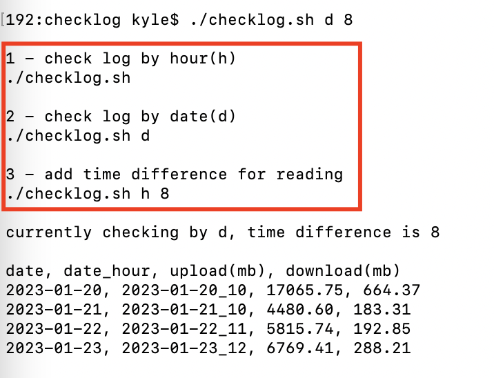
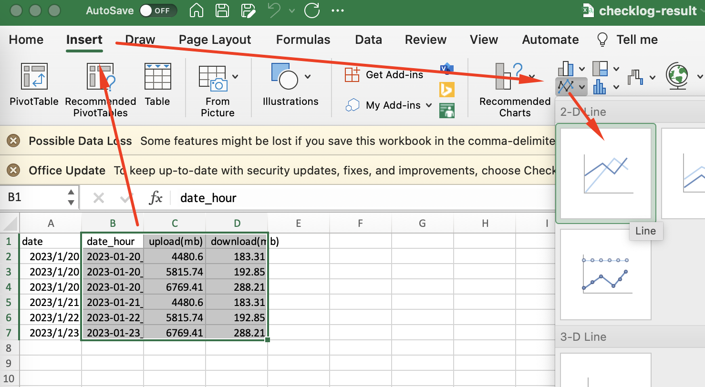
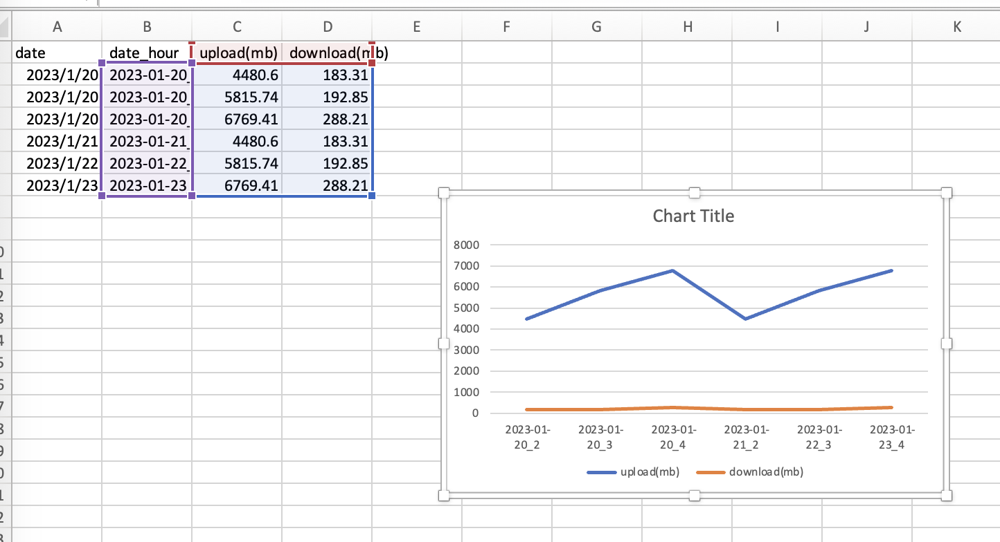

# jfrog checklog

- desc

        You can use this shell script to quickly check artifactory's logs.
        The results will be displayed intuitively in the form of reports.
        In this way, we can understand the upload and download volume every hour or every day, and gain insight into the load of the system, so as to make optimization or expansion decisions.

        你可以利用这个 shell 脚本快速的检查 artifactory 的日志。
        结果将以报表的形式直观的展示出来。
        从而能够了解每个小时或者每天的上传下载量，洞察到系统的负载情况，以便做出优化或者扩容的决策。

- start to use

        1. go to the path of artifactory-request.log

                e.g.   
                cd /opt/jfrog/artifactory/var/log
                
        2. run the script

                ./checklog.sh
                the script prints results & save results into checklog-result.csv

                by default it checks by hour, you can also check by day
                ./checklog.sh d

  

        3. generate report

                1. open checklog-result.csv
                2. select columns, e.g. select date_hour, upload, download

  

                3. select insert > 2-D line

 

